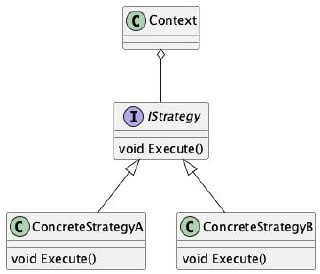
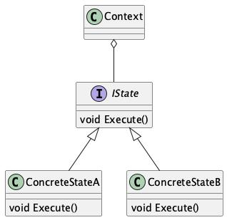
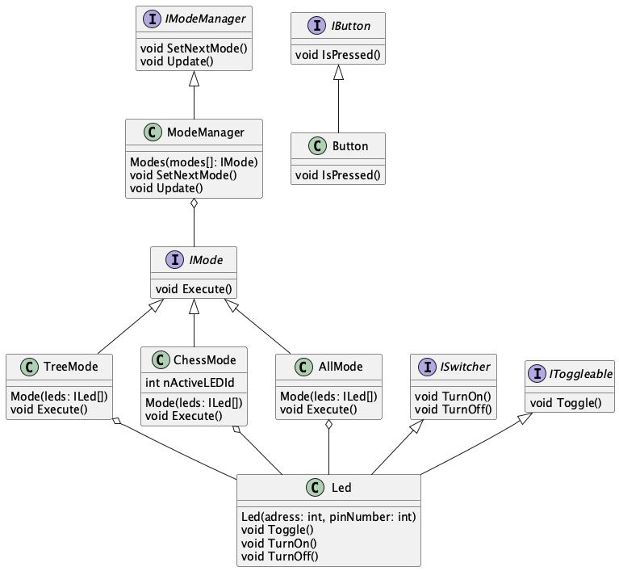
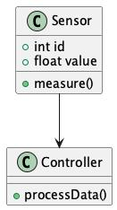
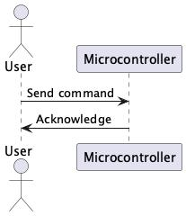
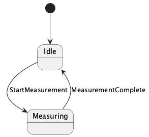
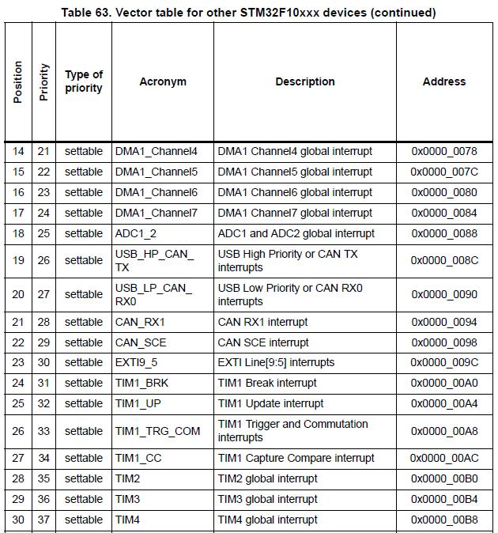

= ОТЧЕТ 3
:toc:
:toc-title: Оглавление
:toclevels: 3
:sectnums:
:sectnumlevels: 3
:icons: font
:figure-caption: Рисунок

include::titylnik.adoc[]

== Цель

Цель отчета – узнать, для чего применяются прерывания, что такое NVIC, настройки таймеров.

== Использование шаблонов проектирования

Шаблон проектирования — это типовое, проверенное решение часто встречающейся проблемы в разработке программного обеспечения. Он не является готовым кодом, а представляет собой общую концепцию или подход, который можно адаптировать под конкретную задачу.

=== Стратегия (Strategy)

Позволяет выбирать алгоритм поведения во время выполнения программы.

.Диаграмма шаблона "Стратегия"

=== Состояние (State)

Позволяет объекту менять своё поведение в зависимости от внутреннего состояния.

.Диаграмма шаблона "Состояние"

== Структура проекта

Проект организован модульно, что упрощает поддержку и расширение.

.Диаграмма структуры проекта

== Как работают прерывания? Какие бывают прерывания? Что происходит при их возникновении?

*Прерывания* — это механизм, который позволяет микроконтроллеру приостанавливать выполнение основной программы для реагирования на внешние или внутренние события и переходить к выполнению функции-обработчика прерывания.

=== Типы прерываний:

* Внешние: прерывания, вызванные внешними устройствами, такими как кнопки, датчики и другие устройства.
* Внутренние: прерывания, генерируемые периферийными устройствами микроконтроллера, такими как таймеры, АЦП, UART и другие модули.
* Системные: прерывания от системных таймеров, например, SysTick, который генерирует регулярные интервалы времени.

=== Что происходит при возникновении прерывания?

* Выполняемая в данный момент инструкция приостанавливается.
* Сохраняется адрес текущей инструкции.
* Переход к обработчику прерывания, который определяется через таблицу векторов прерываний.
* После выполнения обработчика прерывания управление возвращается к основной программе.

== Что такое контроллер прерываний NVIC?

*NVIC (Nested Vectored Interrupt Controller)* — это встроенный в ядро ARM Cortex-M контроллер прерываний, который управляет обработкой прерываний в системе.

=== Основные функции NVIC:

* Приоритизация прерываний: NVIC позволяет задавать приоритеты для разных прерываний.
* Маскирование/разрешение прерываний: возможно включать или отключать отдельные прерывания.
* Быстрое переключение между прерываниями: NVIC поддерживает быстрое реагирование на прерывания с высоким приоритетом.
* Вложенные прерывания: прерывание с более высоким приоритетом может прервать выполнение более низкоприоритетного прерывания.

== PlantUML

PlantUML — это инструмент, позволяющий создавать диаграммы с помощью текстовых описаний, без необходимости использования графических редакторов.

=== Что можно создавать с помощью PlantUML

* Диаграммы классов — отображение связей между классами, их полей и методов
* Диаграммы последовательности (sequence) — показывают, как объекты взаимодействуют во времени
* Диаграммы состояний — отображают переходы между состояниями объекта
* Диаграммы компонентов — описывают архитектуру компонентов системы
* Диаграммы пакетов — представляют логическую группировку классов и модулей
* Диаграммы прецедентов (use case) — демонстрируют взаимодействие пользователей (акторов) с системой
* Диаграммы активности — описывают логику бизнес-процессов или алгоритмов

=== Пример диаграмм PlantUML

.Диаграмма классов

.Диаграмма последовательности

.Диаграмма состояний

== Принципы SOLID

=== Принцип единственной ответственности (SRP)

* Каждый класс должен иметь только одну ответственность, то есть решать одну конкретную задачу. Это упрощает поддержку и модификацию кода.

=== Принцип инверсии зависимостей (DIP)

* Модули верхнего уровня не должны зависеть от модулей нижнего уровня — оба типа модулей должны зависеть от абстракций.  
* Абстракции не должны зависеть от деталей, напротив — детали должны зависеть от абстракций.

== Что такое таблица векторов прерываний?

*Таблица векторов прерываний* — это массив указателей на функции-обработчики прерываний, расположенный в начале памяти микроконтроллера.

Таблица включает:

* Адрес начала стека.
* Адреса обработчиков для различных типов исключений и прерываний: Reset, NMI, HardFault и других.

.Таблица векторов прерываний

== Что такое обработчик прерываний и как его правильно писать?

*Обработчик прерываний (ISR, Interrupt Service Routine)* — это функция, которая выполняется при возникновении прерывания.

=== Рекомендации по написанию обработчика прерывания:

* Сбрасывайте флаг прерывания внутри обработчика. Это важно для правильной работы системы.
* Минимизируйте логику в обработчике — обработчик должен быть как можно более коротким.
* Не вызывайте тяжелые функции, такие как printf, в обработчике прерывания, так как это может вызвать задержки.

== Обработка события переполнения таймера 2 через прерывание. Как это происходит?

*TIM2* — 32-битный таймер общего назначения, который может генерировать прерывание при переполнении, когда счетчик достигает заданного значения в регистре ARR и обнуляется.

=== Шаги настройки таймера TIM2:

* Подключите тактирование модуля TIM2:
   RCC->APB1ENR |= RCC_APB1ENR_TIM2EN
* Установите делитель (PSC) и значение автоперезагрузки (ARR), чтобы задать интервал.
* Включите прерывание по переполнению:
   TIM2->DIER |= TIM_DIER_UIE
* Очистите флаг переполнения:
   TIM2->SR &= ~TIM_SR_UIF
* Включите таймер:
   TIM2->CR1 |= TIM_CR1_CEN
* Разрешите прерывание в NVIC:
   NVIC_EnableIRQ(TIM2_IRQn)

=== Когда таймер переполняется:

* Счетчик обнуляется.
* Устанавливается флаг переполнения (UIF).
* Генерируется прерывание.
* NVIC вызывает обработчик прерывания TIM2_IRQHandler, который выполнит необходимые действия.

== Краткий вывод

Прерывания позволяют мгновенно реагировать на события, временно прерывая основную программу.

* NVIC управляет приоритетами и обработкой.
* Обработчики (ISR) должны быть краткими.
* Пример с TIM2 показывает настройку таймерных прерываний.

